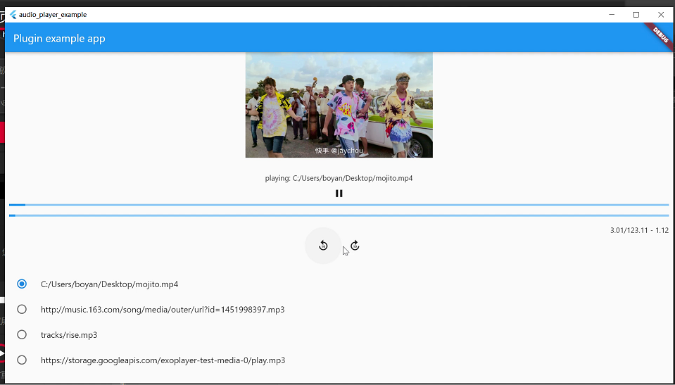

# media_player

A simple audio/video player example for flutter. based on [ffplay](http://ffmpeg.org/).



This is my training project when I was learning C++.

* audio/video demux by ffmpeg.

* audio render by [SDL2](https://github.com/libsdl-org/SDL) (Windows, Linux), [Oboe](https://github.com/google/oboe) (
  Android), AudioQueue(macos).

* video render by SDL2(example) / `TextureWidget`(flutter).

| platform | status       |
| -------- | ------------ |
| Windows  | ✅            |
| Linux    | ⭕ audio only |
| macOS    | ✅            |
| Android  | ✅            |
| iOS      | ⭕            |

## Getting Started

### How to Build Porject?

requirement:

* flutter version: 2.0

#### Desktop (Windows/Linux/macOS)

1. set up your enviorenment for desktop build. see more [ffplayer](ffplayer/README.md)
  * for macos, you need go to `/ffplayer` run `./macos-flutter-install.sh`.
2. install flutter.
3. `flutter run`

#### Android

1. install flutter
2. `flutter build apk`

## Dev Tips

### how to debug c/c++ code if we build for flutter ?

#### Windows

1. run windows app.

```shell
flutter run -d windows
```

2. open `example/build/windows/media_player_example.sln` by visual studio 2019
3. mark `media_player_example` as run program. (which ALL_BUILD is default selected, but we can not run it).
4. click run with local debug. then waiting for crash.

##### Linux

1. add remote gdb debug configuration. target remote args set

```
127.0.0.1:1234
```

2. run the application which flutter build with debug.

```shell
gdbserver :1234 build/linux/debug/bundle/audio_player_example
```

# LICENSE

[MIT](LICENSE)
